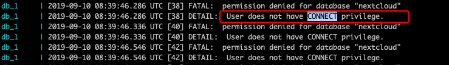

# nextcloud-docker
Nextcloud docker with Postgres + Redis + Nginx

## NOTE
POSTGRES_USER=postgres should not be changed, or you may got the weird issue when init NextCloud:

> fatal: permission denied for database "nextcloud" detail: user does not have connect privilege.
>

The solution is provided by @M034B5, the only one that works for me.
https://github.com/nextcloud/docker/issues/345#issuecomment-494024363

## My Website
欢迎访问我的技术博客 https://xmanyou.com

